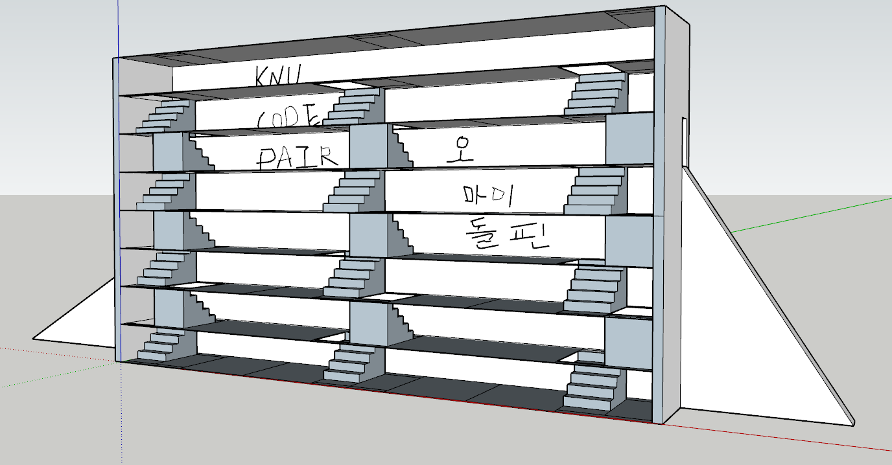
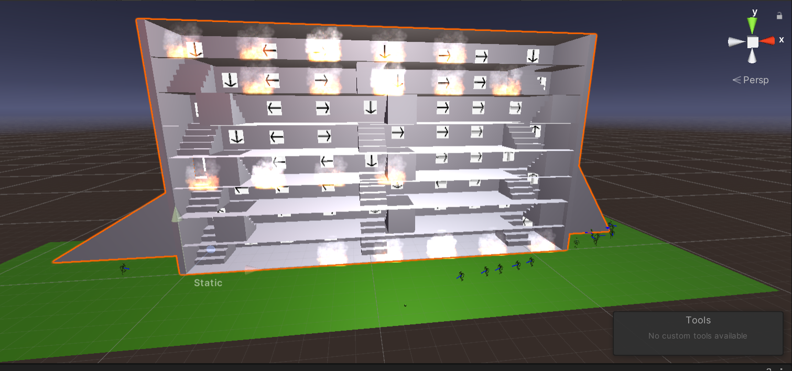
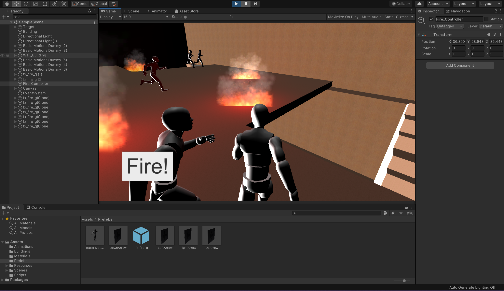
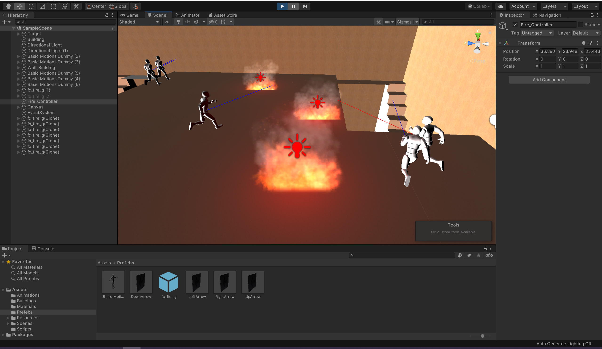
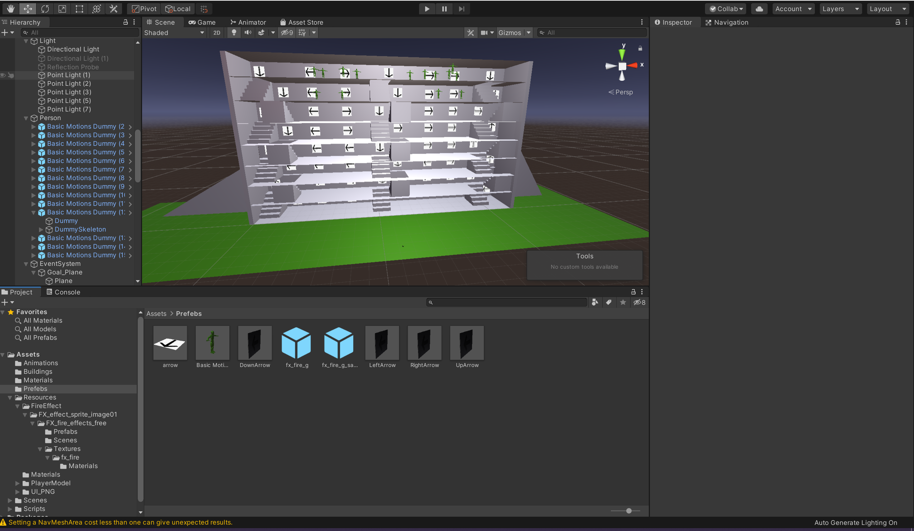

## 2020_CodeFair (화재 대피 시스템)

>   내용 : 다익스트라 알고리즘을 기반으로 하여 건물 내의 화재 대피 시스템 구현.

-	어떤 방식으로 탈출구까지 유도할 것이고, 효율적인 알고리즘 탐색
(불이 퍼질 방향, 사람 밀집도에 따른 이동속도 등의 데이터 분석)     
-	문제점 : 학습을 위한 데이터 셋 부족. 데이터를 얻을 수 있는 방법이 있다면 고려해본다.

>   조건
> -> 시작할 때 랜덤층 / 랜덤 노드에서 불이 번진다.
-> Person Object들은 1층의 Target을 가장 빠르고 안전한(가중치의 합이 가장 적은 길) 길을 찾아서(Unity 엔진의 Navmesh 기능 활용) 간다.
-> 가는 길에 불이 나거나 번지면 다른 길을 다시 찾아서 간다.
-> 비상 탈출구의 가중치는 0 이다.
-> IronPython 패키지를 통해 C#에서 Python 코드를 불러들여서 Python을 작성된 알고리즘을 수행한다. - 이에 따라 대피 방향 화살표가 바뀐다.

- SketchUp 프로그램으로 건물 기초 작업 실시

## 업무 분담
-	시뮬레이션을 해보기 위해 유니티로 화재상황 구현.
-	길찾기 알고리즘을 조사 및 분석실시.
-	유니티로 회재상황을 구현하여 화재상황에서 잘 적용되는지 시뮬레이션 실시.
-	건물의 구조를 단위별로 나눠 각 노드로 설정하고 이를 그래프로 구성
-	각 노드마다 탈출구로 향하는 방향 표시등을 설정하고 이를 통해 대피경로 구현
-	그래프에서 최적경로 알고리즘을 이용하여 탈출구 방향 표시

## C#기반 Unity 3D 시뮬레이션 상황 - 권현수

>   [FireSpreadController.cs - 화재가 번지게 하는 스크립트](FireSpreadController.cs)     
>   [FireController.cs - 화재 초기 생성 스크립트](FireController.cs)     
>   [ScoreController.cs - UI 제어 스크립트](ScoreController.cs)     
>   [ScoreController.cs - C# - Python제어 스크립트](PythonController.cs)     
>   [PersonMove.cs - NavMesh를 이용하여 사람이 길을 찾게하는 스크립트](PersonMove.cs)   
>   [PersonRayCast.cs - 사람을 기준으로 Ray를 쏘아 불을 감지하는 스크립트](PersonRayCast.cs)    
